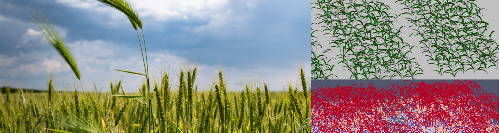

# CPB-LiDAR
A virtual pipeline to study sensitivity of UAV-like LiDAR metrics to plant parameters using structural modeling and machine learning.

This project uses **CPlantBox** (2022 release) to generate virtual fields, from which artificial LiDAR metrics are extracted. 
Next, the relations between such artificial LiDAR metrics and plant parameters can be investigated.

## Installation : 
- CPlantBox : [2022 release](https://github.com/Plant-Root-Soil-Interactions-Modelling/CPlantBox/releases/tag/v1.1) (DOI : [10.5281/zenodo.6953939](https://doi.org/10.5281/zenodo.6953939)). Follow instructions in CPlantBox repository.
- Drop the folder of this project (CPB-LiDAR) into CPlantBox-master/CPB/CPlantBox/

